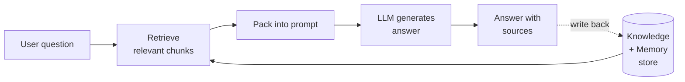
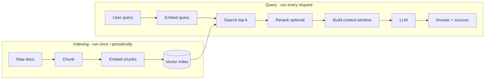
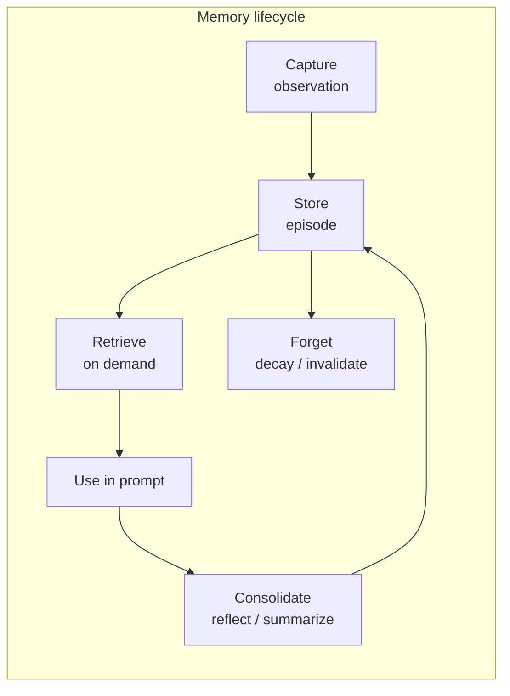

# RAG Memory — A Builder's Guide

> A learning-first wiki for AI Product Managers and builders shipping their first RAG Memory product.
> Three reading levels. Same source of truth as `THEORY.md`, just unpacked.

**Project:** rag-memory-playground
**Audience:** PM / builder, beginner to intermediate
**Last updated:** 2026-05-22

---

## How to read this doc

| Level | For whom | Time | What you get |
|---|---|---|---|
| **Level 1 — Plain English** | Curious PM, exec, designer | 10 min | What RAG Memory is, why it exists, when to use it |
| **Level 2 — Practical Architecture** | Builder, engineer, technical PM | 30 min | Components, pipelines, design choices, failure modes |
| **Level 3 — Research Appendix** | Researcher, deep diver | 60 min | All papers, all citations, all the receipts |

Each tricky term below appears in this shape:

> **Term**
> - **Simple idea** — what it is in one sentence
> - **Product example** — where you'd see it in a real product
> - **Technical version** — the engineering reality
> - **Common failure** — how it breaks in production

---

# LEVEL 1 — Plain English

## What is RAG?

A language model alone is like a brilliant employee who never reads their email. They know a lot in general, but they don't know **your** documents, **your** customers, or **what happened yesterday**.

**RAG** (Retrieval-Augmented Generation) gives the model an external library. Before answering, the system **looks up** relevant material and hands it to the model. The model then writes an answer **grounded** in that material.

```
Question → Look up relevant docs → Give docs + question to LLM → Answer
```

### Why it matters for a product
- Your model can answer about **your private data** (manuals, tickets, wikis).
- Answers cite **sources** — much harder to hallucinate.
- You can **update** the knowledge base without retraining the model.

## What is Memory (the agent kind)?

Memory is RAG's cousin. RAG retrieves from a **knowledge base** that you curated. Memory retrieves from the **history** of what the agent has seen — conversations, observations, prior actions.

> **Memory in plain words**
> - **Simple idea** — the agent remembers what happened so it can act consistently next time
> - **Product example** — a personal assistant that remembers you're allergic to peanuts after one mention
> - **Technical version** — append-only log of events, indexed for retrieval, scored for relevance and recency
> - **Common failure** — remembering stale facts ("you live in Berlin" after you moved to Lisbon)

## RAG vs Long Context vs Memory — pick your tool

| Approach | What it is | Best for | Cost | Watch out for |
|---|---|---|---|---|
| **Long Context** | Stuff everything in the prompt | One-off analysis of a big doc | High $/query | Model loses things in the middle of long inputs |
| **RAG** | Retrieve only relevant chunks | Stable knowledge bases, FAQs, docs | Low | Bad retrieval = bad answers |
| **Memory** | Retrieve from agent history | Personal assistants, long-running agents | Medium | Stale, contradictory, drifting facts |
| **Hybrid (route by query)** | Pick the right tool per question | Production systems | Medium | More moving parts to monitor |

The honest answer: **production systems use a hybrid.** Cheap things go to RAG, complex synthesis goes to long context, personal/conversational things go to memory.

## When do you need RAG Memory?

You need it the moment any of these is true:

1. The user expects the agent to **remember them across sessions**.
2. The product is an **assistant or coach**, not a one-shot tool.
3. You need answers grounded in **fresh** or **private** information.
4. Hallucination is a real product risk (legal, medical, finance, support).

If none of the above is true, you may not need RAG Memory yet. Start simpler.

## The mental model



The dotted line is what makes it **memory**, not just RAG: the system writes back what it learns.

---

# LEVEL 2 — Practical Architecture

This level assumes you'll be making real choices: which embedder, which index, how to chunk, how to evaluate.

## 2.1 The basic RAG pipeline



Six dials you control:

| Dial | What it does | Typical default |
|---|---|---|
| **Embedder** | Turns text into vectors | E5, BGE, OpenAI text-embedding-3 |
| **Chunk size** | How much text per vector | 256–512 tokens, sentence boundary |
| **Index** | Fast nearest-neighbour search | HNSW |
| **Top-k** | How many chunks to fetch | 5–20 |
| **Reranker** | Re-scores candidates with a stronger model | Cross-encoder on top-50 → keep top-5 |
| **Prompt assembly** | How chunks are pasted into the prompt | Best chunk first, then by score |

## 2.2 The RAG Memory pipeline

Memory adds three things on top: **write**, **consolidate**, **forget**.



> **Capture**
> - **Simple idea** — write down what just happened
> - **Product example** — assistant logs "user prefers metric units"
> - **Technical version** — append an event to a memory stream with timestamp, source, importance score
> - **Common failure** — capture every keystroke, drown the system in noise

> **Consolidate**
> - **Simple idea** — summarize a bunch of small memories into a bigger insight
> - **Product example** — after 20 chats, agent notes "user is preparing for a Berlin → Lisbon move"
> - **Technical version** — periodic LLM pass that reads recent memories and writes higher-level "reflections" back into the store
> - **Common failure** — reflections drift away from facts and compound errors over months

> **Forget**
> - **Simple idea** — let unused facts fade, mark wrong ones as invalid
> - **Product example** — old address is shadowed when a new one arrives
> - **Technical version** — exponential decay on access time, or explicit invalidation when contradicted
> - **Common failure** — store has no notion of contradiction, so old and new coexist and the model picks at random

## 2.3 Memory types — pick the right shape

Cognitive science offers a clean taxonomy that maps directly onto agent design.

| Memory type | Plain words | Product example | Where to store it |
|---|---|---|---|
| **Episodic** | "What happened" | Chat logs, task traces | Append-only stream + vector index |
| **Semantic** | "What is true" | User profile facts, product catalog | Key-value store or knowledge graph |
| **Procedural** | "How to do X" | Learned workflow patterns | Skill registry, prompt library |
| **Working** | "What I'm holding right now" | Current conversation turn | LLM context window |

A useful product rule: **don't mix types in one store.** Episodic stuff is noisy and volume-heavy; semantic stuff is small and high-value. Treat them differently.

## 2.4 The retrieval scoring formula

The most-copied scoring heuristic in agent memory is a weighted blend:

```
score = α_recency · recency  +  α_importance · importance  +  α_relevance · relevance
```

- **Recency** — exponential decay since last access
- **Importance** — how big a deal was this event (LLM-rated 1–10, or rule-based)
- **Relevance** — cosine similarity to current query

Start with all weights at 1, then tune on your eval set. This formula comes from the Generative Agents work — see Level 3 [13].

## 2.5 Retrieval metrics — what they mean

| Metric | What it measures | Plain explanation |
|---|---|---|
| **Recall@k** | Did the right doc make the top-k list? | "Out of the docs I needed, how many did I find in the top 10?" |
| **MRR** | How high did the first correct doc rank? | "If I'm right on the first try, MRR = 1. If the first hit was rank 4, MRR = 0.25." |
| **nDCG@k** | Quality-weighted ranking | "Reward putting the best doc first. Penalize burying it." |
| **Faithfulness (RAGAS)** | Is the answer supported by the retrieved context? | "Did the model invent things or stick to the sources?" |
| **Answer relevance (RAGAS)** | Did it actually answer the question? | "On-topic or rambling?" |
| **Context relevance (RAGAS)** | Did we even retrieve the right stuff? | "Junk in → junk out diagnosis." |

For a playground, the minimum honest harness is:
1. **Retrieval** — Recall@k and nDCG@k on a tiny synthetic gold set.
2. **Generation** — RAGAS faithfulness + answer relevance.
3. **Memory** — a multi-session probe (e.g., LongMemEval subset).
4. **Cost** — tokens/query and p95 latency.

## 2.6 Common architectural patterns

| Pattern | What it does | When to use |
|---|---|---|
| **Naive RAG** | Embed → search → stuff into prompt | First prototype, FAQs, single-turn |
| **Hybrid RAG** | Dense vectors + BM25 keyword search | Domain-specific or keyword-heavy data |
| **Rerank RAG** | Cheap retrieval, then expensive reranker | When precision matters and latency budget allows |
| **Adaptive RAG** | Model decides whether to retrieve | Saves cost when model already knows the answer |
| **Corrective RAG** | Detect bad retrieval, fall back to web search | Critical-accuracy use cases |
| **Graph / Multi-hop RAG** | Traverse a knowledge graph for chained reasoning | Multi-hop questions ("Who is X's manager's manager?") |
| **Tiered Memory (OS-style)** | Hot "main" memory + cold "archival" storage, managed by the model itself | Long-running agents with bounded context |

## 2.7 Failure modes you will hit

Real builders meet these in this order:

1. **Garbage retrieval** — your top-5 has nothing to do with the question. Fix: better chunking, hybrid search, reranker.
2. **Lost in the middle** — even when retrieval is good, the LLM ignores chunks in the middle of the context. Fix: keep context tight, put best chunks at the start or the end.
3. **Hallucination despite retrieval** — model trusts its parametric knowledge over the retrieved context. Fix: stricter prompting, context-aware decoding, smaller-but-better context.
4. **Stale memory** — last month's facts conflict with this week's. Fix: explicit invalidation, recency weighting, contradiction detection.
5. **Persona / reflection drift** — long-running agents accumulate weird beliefs from compounding bad summaries. Fix: periodic re-grounding from raw sources.
6. **Privacy and forgetting** — user wants their data deleted; your vector store doesn't make that easy. Fix: design deletion in from day one.
7. **Cost explosion** — naive retrieval grew from 1k to 100k chunks/day. Fix: deduplication, decay, cold-archive tiers.

## 2.8 Three hypotheses worth testing in the playground

These are clean, falsifiable experiments. Each yields a useful product result regardless of outcome.

1. **H1 — Adaptive retrieval pays for itself.** Letting the model decide whether to retrieve cuts cost without hurting quality. Test by measuring tokens/query and faithfulness with and without an adaptive gate.
2. **H2 — Graph memory beats flat vectors on multi-hop.** For "who is X's manager's manager"-style questions, a graph traversal layered on top of vectors outperforms flat top-k.
3. **H3 — Reflection-style consolidation reduces context bloat.** Periodic summarisation keeps the working context small without losing recall on multi-session probes.

The receipts behind each hypothesis are in Level 3.

---

# LEVEL 3 — Research Appendix

Everything in Levels 1 and 2 is sourced from peer-reviewed papers, arXiv preprints, or canonical monographs. This section lists them. Quotes are short (< 15 words) and attributed to primary sources.

## 3.1 RAG foundations

The term "RAG" was coined by Lewis et al. at NeurIPS 2020, combining a generator (BART) with a dense Wikipedia index [1]. Their stated goal: build "models which combine pre-trained parametric and non-parametric memory" [1]. Two months earlier, REALM had pioneered **latent retrieval during pre-training**, training a retriever jointly with the LM [2].

The dense retrieval component used by Lewis et al. — **DPR** — was itself a 2020 contribution showing dense bi-encoders can outperform BM25 "by 9%–19% absolute" on top-20 passage retrieval [3]. **Fusion-in-Decoder** (FiD) then showed that performance "significantly improves when increasing the number of retrieved passages" if the encoder encodes them independently and the decoder fuses them [4].

**Atlas** extended RAG to the few-shot regime, achieving "over 42% accuracy on Natural Questions using only 64 examples" with 50× fewer parameters than baselines [5].

Later refinements made retrieval *adaptive*. **Self-RAG** introduced reflection tokens letting the model decide when to retrieve and how to use the result [6]. **CRAG** added a retrieval evaluator with a web-search fallback when retrieval quality is judged inadequate [7].

The **RAG vs long-context** debate produced two definitive comparisons. Li et al. found long-context "consistently outperforms RAG" on accuracy but "RAG's significantly lower cost remains a distinct advantage" [8]. Yu et al. confirmed a nuanced picture: RAG wins on fact lookup, long context wins on multi-source synthesis [9]. Roberts et al. provide the closed-book baseline — what the LM already knows without any retrieval [10]. Gao et al.'s survey is the top-down map [11].

## 3.2 Memory architectures

**MemGPT** drew the OS analogy: "virtual context management, a technique drawing inspiration from hierarchical memory systems in traditional operating systems" [12]. The LM itself emits function calls to page data between in-context and external storage.

**Generative Agents** introduced the three-pillar architecture — memory stream, reflection, retrieval — and the now-standard scoring formula `recency + importance + relevance` [13].

**A-MEM** applies the Zettelkasten knowledge-management method, building a graph where notes link to other notes via LLM-driven analysis [14]. This addresses contradictions that flat vector stores cannot.

**MemoryBank** introduced explicit Ebbinghaus-style forgetting: "MemoryBank incorporates a memory updating mechanism inspired by the Ebbinghaus Forgetting Curve theory" [15].

**HippoRAG** draws on hippocampal indexing theory, running **Personalized PageRank** over a knowledge graph anchored on query entities, "orchestrating LLMs, knowledge graphs, and the Personalized PageRank algorithm to mimic the different roles of neocortex and hippocampus" [16]. Strong on multi-hop QA.

**Reflexion** is a per-trial verbal-RL loop: "Reflexion converts binary or scalar feedback from the environment into verbal feedback in the form of a textual summary" [17] — a lightweight procedural memory.

**Letta** is MemGPT's production descendant, standardising core/archival/recall memory tiers [18].

### Summary table

| System | Core idea | Memory shape | Adaptation mechanism |
|---|---|---|---|
| MemGPT [12] | OS-style tiered context | Hierarchical (main / external) | Self-paging via tool calls |
| Generative Agents [13] | Recency × importance × relevance | Stream + reflections | LLM reflection |
| A-MEM [14] | Zettelkasten note-linking | Graph | Dynamic re-linking |
| MemoryBank [15] | Forgetting curve | Stream + decay | Time-based forgetting |
| HippoRAG [16] | Hippocampal index + PageRank | Knowledge graph | Indexing pass |
| Reflexion [17] | Verbal RL | Episodic critique buffer | Per-trial critique |
| Letta [18] | Stateful agent OS | Core / archival / recall | LM-driven |

## 3.3 Vector retrieval

**Sentence-BERT** made dense retrieval practical, "reducing the effort for finding the most similar pair from 65 hours with BERT/RoBERTa to about 5 seconds" [19].

**E5** is the first dense model to outperform BM25 on BEIR "without using any labeled data" [20]. **BGE / C-Pack** is the BAAI alternative family, supporting dense, multi-vector, and sparse modes in one model [21].

**HNSW** is the dominant ANN index in production: "logarithmic complexity scaling" of search time with dataset size [22]. Key knobs: `M`, `ef_construction`, `ef_search`. **ScaNN** is Google's alternative with anisotropic quantisation, "outperforming other vector similarity search libraries by a factor of two" on ann-benchmarks [23].

**ColBERT** abandons single-vector pooling in favour of **late interaction**: multi-vector documents scored via MaxSim at query time [24]. **BM25** remains a strong sparse baseline and is canonical in Robertson & Zaragoza's monograph [25].

**Hybrid retrieval and reranking** are documented in Gao's survey [11] and in Wang et al.'s "best practices" study [26]. **Chunking** is decisively non-trivial: a 2025 multi-dataset study concludes "smaller chunks (64–128 tokens) are optimal for datasets with concise, fact-based answers, whereas larger chunks (512–1024 tokens) improve retrieval in datasets requiring broader contextual understanding" [27]. A 2026 systematic analysis agrees and largely deprecates overlap as a tuning dial [28].

## 3.4 Memory taxonomies (cognitive science roots)

The **episodic / semantic** distinction is Tulving's, from his 1972 chapter [29] and his 1985 *Memory and Consciousness* paper [30]. Tulving later added procedural memory and a multi-store theory.

The **forgetting curve** comes from Ebbinghaus's 1885 monograph *Über das Gedächtnis*, showing retention decays roughly logarithmically with time and is slowed by spaced rehearsal [31]. MemoryBank [15] is a direct LLM-era application.

**Atkinson & Shiffrin (1968)** gave us the sensory / short-term / long-term multi-store model, which maps cleanly onto LLM-agent architectures (observation buffer / context window / external store).

Zhang et al.'s 2024 survey of LLM-agent memory mechanisms is the field's current synthesis, organising work along **sources / forms / operations** [32].

## 3.5 Evaluation

**RAGAS** [33] introduced reference-free LLM-judged metrics for faithfulness, answer relevance, and context relevance.

**LongMemEval** [34] reports that "commercial chat assistants and long-context LLMs show a 30% accuracy drop on memorizing information across sustained interactions" — across five abilities (extraction, multi-session, temporal, knowledge update, abstention).

**LoCoMo** [35] uses 300-turn dialogues averaging 9k tokens over up to 35 sessions; "LLMs exhibit challenges in understanding lengthy conversations and comprehending long-range temporal and causal dynamics within dialogues" [35].

**BEIR** [36] and **MTEB** [37] are the standard benchmarks for retrieval and embeddings respectively.

Classical IR metrics: Recall@k, MRR, nDCG@k.

## 3.6 Failure modes

**Lost in the Middle** (Liu et al., 2023): "performance is often highest when relevant information occurs at the beginning or end of the input context, and significantly degrades when models must access relevant information in the middle of long contexts" [38].

**Context-aware Decoding (CAD)** (Shi et al., 2023) "amplifies the difference between the output probabilities when a model is used with and without context" — reported "14.3% gain for LLaMA in factuality metrics" [39]. Useful when retrieval contradicts parametric priors.

**Stale memory, contradiction resolution, retrieval noise, and the cost asymmetry between long-context and retrieval** are open problems flagged across [7], [8], [9], [14], [15], and [34].

## References

[1] Lewis, P., et al. (2020). *Retrieval-Augmented Generation for Knowledge-Intensive NLP Tasks*. NeurIPS 2020. arXiv:2005.11401. https://arxiv.org/abs/2005.11401

[2] Guu, K., Lee, K., Tung, Z., Pasupat, P., & Chang, M. (2020). *REALM: Retrieval-Augmented Language Model Pre-Training*. ICML 2020. arXiv:2002.08909. https://arxiv.org/abs/2002.08909

[3] Karpukhin, V., et al. (2020). *Dense Passage Retrieval for Open-Domain Question Answering*. EMNLP 2020. arXiv:2004.04906. https://arxiv.org/abs/2004.04906

[4] Izacard, G., & Grave, E. (2021). *Leveraging Passage Retrieval with Generative Models for Open Domain Question Answering*. EACL 2021. arXiv:2007.01282. https://arxiv.org/abs/2007.01282

[5] Izacard, G., et al. (2022). *Atlas: Few-shot Learning with Retrieval Augmented Language Models*. arXiv:2208.03299. https://arxiv.org/abs/2208.03299

[6] Asai, A., Wu, Z., Wang, Y., Sil, A., & Hajishirzi, H. (2023). *Self-RAG: Learning to Retrieve, Generate, and Critique through Self-Reflection*. arXiv:2310.11511. https://arxiv.org/abs/2310.11511

[7] Yan, S.-Q., Gu, J.-C., Zhu, Y., & Ling, Z.-H. (2024). *Corrective Retrieval Augmented Generation*. arXiv:2401.15884. https://arxiv.org/abs/2401.15884

[8] Li, Z., Li, C., Zhang, M., Mei, Q., & Bendersky, M. (2024). *Retrieval Augmented Generation or Long-Context LLMs? A Comprehensive Study and Hybrid Approach*. arXiv:2407.16833. https://arxiv.org/abs/2407.16833

[9] Yu, X. et al. (2025). *Long Context vs. RAG for LLMs: An Evaluation and Revisits*. arXiv:2501.01880. https://arxiv.org/abs/2501.01880

[10] Roberts, A., Raffel, C., & Shazeer, N. (2020). *How Much Knowledge Can You Pack Into the Parameters of a Language Model?*. EMNLP 2020. arXiv:2002.08910. https://arxiv.org/abs/2002.08910

[11] Gao, Y., et al. (2023). *Retrieval-Augmented Generation for Large Language Models: A Survey*. arXiv:2312.10997. https://arxiv.org/abs/2312.10997

[12] Packer, C., et al. (2023). *MemGPT: Towards LLMs as Operating Systems*. arXiv:2310.08560. https://arxiv.org/abs/2310.08560

[13] Park, J. S., O'Brien, J. C., Cai, C. J., Morris, M. R., Liang, P., & Bernstein, M. S. (2023). *Generative Agents: Interactive Simulacra of Human Behavior*. UIST 2023. arXiv:2304.03442. https://arxiv.org/abs/2304.03442

[14] Xu, W., Liang, Z., Mei, K., Gao, H., Tan, J., & Zhang, Y. (2024). *A-MEM: Agentic Memory for LLM Agents*. arXiv:2502.12110. https://arxiv.org/abs/2502.12110

[15] Zhong, W., Guo, L., Gao, Q., Ye, H., & Wang, Y. (2023). *MemoryBank: Enhancing Large Language Models with Long-Term Memory*. arXiv:2305.10250. https://arxiv.org/abs/2305.10250

[16] Gutiérrez, B. J., Shu, Y., Gu, Y., Yasunaga, M., & Su, Y. (2024). *HippoRAG: Neurobiologically Inspired Long-Term Memory for Large Language Models*. NeurIPS 2024. arXiv:2405.14831. https://arxiv.org/abs/2405.14831

[17] Shinn, N., Cassano, F., Berman, E., Gopinath, A., Narasimhan, K., & Yao, S. (2023). *Reflexion: Language Agents with Verbal Reinforcement Learning*. NeurIPS 2023. arXiv:2303.11366. https://arxiv.org/abs/2303.11366

[18] Letta (formerly MemGPT) — productionised descendant of [12]. https://docs.letta.com/concepts/letta/

[19] Reimers, N., & Gurevych, I. (2019). *Sentence-BERT: Sentence Embeddings using Siamese BERT-Networks*. EMNLP 2019. arXiv:1908.10084. https://arxiv.org/abs/1908.10084

[20] Wang, L., et al. (2022). *Text Embeddings by Weakly-Supervised Contrastive Pre-training*. arXiv:2212.03533. https://arxiv.org/abs/2212.03533

[21] Xiao, S., Liu, Z., Zhang, P., & Muennighoff, N. (2023). *C-Pack: Packaged Resources To Advance General Chinese Embedding*. arXiv:2309.07597. https://arxiv.org/abs/2309.07597

[22] Malkov, Y. A., & Yashunin, D. A. (2018). *Efficient and robust approximate nearest neighbor search using Hierarchical Navigable Small World graphs*. IEEE TPAMI 42(4). arXiv:1603.09320. https://arxiv.org/abs/1603.09320

[23] Guo, R., et al. (2020). *Accelerating Large-Scale Inference with Anisotropic Vector Quantization*. ICML 2020. arXiv:1908.10396. https://arxiv.org/abs/1908.10396

[24] Khattab, O., & Zaharia, M. (2020). *ColBERT: Efficient and Effective Passage Search via Contextualized Late Interaction over BERT*. SIGIR 2020. arXiv:2004.12832. https://arxiv.org/abs/2004.12832

[25] Robertson, S., & Zaragoza, H. (2009). *The Probabilistic Relevance Framework: BM25 and Beyond*. Foundations and Trends in Information Retrieval, 3(4), 333–389. DOI:10.1561/1500000019. https://dl.acm.org/doi/abs/10.1561/1500000019

[26] Wang, X., et al. (2024). *Searching for Best Practices in Retrieval-Augmented Generation*. EMNLP 2024. arXiv:2407.01219. https://arxiv.org/abs/2407.01219

[27] *Rethinking Chunk Size for Long-Document Retrieval: A Multi-Dataset Analysis* (2025). arXiv:2505.21700. https://arxiv.org/abs/2505.21700

[28] *A Systematic Analysis of Chunking Strategies for Reliable Question Answering* (2026). arXiv:2601.14123. https://arxiv.org/abs/2601.14123

[29] Tulving, E. (1972). Episodic and semantic memory. In E. Tulving & W. Donaldson (Eds.), *Organization of Memory* (pp. 381–403). Academic Press.

[30] Tulving, E. (1985). *Memory and Consciousness*. Canadian Psychology, 26(1), 1–12. DOI:10.1037/h0080017.

[31] Ebbinghaus, H. (1885). *Über das Gedächtnis: Untersuchungen zur experimentellen Psychologie*. Duncker & Humblot. Modern analysis: Murre & Dros (2015), PLOS ONE 10(7): e0120644. https://journals.plos.org/plosone/article?id=10.1371/journal.pone.0120644

[32] Zhang, Z., et al. (2024). *A Survey on the Memory Mechanism of Large Language Model based Agents*. arXiv:2404.13501. https://arxiv.org/abs/2404.13501

[33] Es, S., James, J., Espinosa-Anke, L., & Schockaert, S. (2023). *RAGAS: Automated Evaluation of Retrieval Augmented Generation*. EACL 2024 demo. arXiv:2309.15217. https://arxiv.org/abs/2309.15217

[34] Wu, D., et al. (2024). *LongMemEval: Benchmarking Chat Assistants on Long-Term Interactive Memory*. ICLR 2025. arXiv:2410.10813. https://arxiv.org/abs/2410.10813

[35] Maharana, A., et al. (2024). *Evaluating Very Long-Term Conversational Memory of LLM Agents*. ACL 2024. arXiv:2402.17753. https://arxiv.org/abs/2402.17753

[36] Thakur, N., Reimers, N., Rücklé, A., Srivastava, A., & Gurevych, I. (2021). *BEIR: A Heterogeneous Benchmark for Zero-shot Evaluation of Information Retrieval Models*. NeurIPS 2021 Datasets. arXiv:2104.08663. https://arxiv.org/abs/2104.08663

[37] Muennighoff, N., Tazi, N., Magne, L., & Reimers, N. (2022). *MTEB: Massive Text Embedding Benchmark*. EACL 2023. arXiv:2210.07316. https://arxiv.org/abs/2210.07316

[38] Liu, N. F., et al. (2023). *Lost in the Middle: How Language Models Use Long Contexts*. TACL 2023. arXiv:2307.03172. https://arxiv.org/abs/2307.03172

[39] Shi, W., Han, X., Lewis, M., Tsvetkov, Y., Zettlemoyer, L., & Yih, W. (2023). *Trusting Your Evidence: Hallucinate Less with Context-aware Decoding*. NAACL 2024 short. arXiv:2305.14739. https://arxiv.org/abs/2305.14739

---

## Source of truth

The dense academic version of this material lives in `THEORY.md` in the same directory. This guide is the readable companion — same evidence, lower activation energy.

*Last verified: 2026-05-22. All arXiv IDs and DOIs confirmed via web search. Quotes are short (< 15 words) and attributed to their primary sources.*
