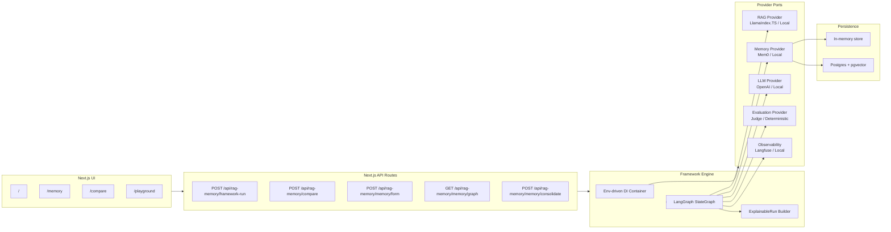

# RAG Memory Playground

**A framework-first lab for building, comparing, and debugging RAG + long-term memory pipelines.**

RAG Memory Playground is an experimentation engine for AI builders who need to understand *why* a retrieval or memory pipeline works, fails, gets expensive, or silently falls back to a mock provider.

It combines:

- **LangGraph orchestration** for explainable multi-step runs
- **RAG retrieval** through LlamaIndex.TS or deterministic local fallback
- **Memory retrieval / formation** through Mem0 or local memory providers
- **OpenAI generation** or deterministic local generation
- **Ragas-shaped evaluation** with an upgrade path to real judge-based evals
- **Langfuse observability** or local traces
- **Postgres + pgvector persistence** when `DATABASE_URL` is configured

> Not just “ask your docs”.  
> This is a playground for understanding retrieval, memory, cost, latency, fallback behavior, and failure modes.

---

## Current Status

`MVP` · `framework-first` · `local-demo friendly` · `real providers when configured`

| Area | Status |
|---|---:|
| LangGraph workflow orchestration | ✅ Real |
| ExplainableRun output contract | ✅ Real |
| Provider status disclosure | ✅ Real |
| Local deterministic demo mode | ✅ Real |
| LlamaIndex.TS retrieval provider | ✅ Env-gated |
| OpenAI generation provider | ✅ Env-gated |
| Mem0 memory provider | ✅ Env-gated |
| Langfuse observability provider | ✅ Env-gated |
| Memory formation pipeline | ✅ Real |
| Visual Memory Lab | ✅ Real |
| Side-by-side comparison | ✅ Real |
| Postgres + pgvector persistence | ✅ Env-gated |
| Ragas-style deterministic eval | ✅ Stub / heuristic |
| Real Ragas sidecar | ⏳ Planned |
| Persisted run history / permalinks | ⏳ Planned |

The project is honest about runtime mode. If a provider is running as a stub or fallback, the response exposes it through `providerStatus`, `failureModes`, and debug metadata.

---

## Why This Exists

RAG and agent memory systems usually fail in ways that are hard to see:

- retrieval returns plausible but wrong chunks
- memory recalls stale or irrelevant facts
- long context works but costs too much
- a reranker improves quality but adds latency
- a production provider silently falls back to a local stub
- evaluation numbers look real but are actually placeholders
- nobody can explain why one pipeline beat another

This project treats the AI pipeline as an inspectable graph instead of a black box.

The goal is simple:

> Make RAG and memory decisions defensible, measurable, and debuggable.

---

## Product Surfaces

| Route | Purpose |
|---|---|
| `/` | Entry screen listing available playground surfaces |
| `/memory` | Visual Memory Lab: raw note → structured long-term memory |
| `/compare` | Side-by-side RAG / memory pipeline comparison |
| `/playground` | Raw framework debug surface with full `ExplainableRun` JSON |
| `/rag-memory-playground` | Legacy / framework debug page |
| `/api/rag-memory/framework-run` | Main framework-first run endpoint |
| `/api/rag-memory/compare` | Side-by-side comparison endpoint |
| `/api/rag-memory/memory/form` | Memory formation endpoint |
| `/api/rag-memory/memory/graph` | Memory graph endpoint |
| `/api/rag-memory/memory/consolidate` | Memory consolidation endpoint |

---

## Product Formula

```txt
User message
  → classify intent
  → choose route: RAG / memory / long-context / hybrid
  → retrieve documents
  → retrieve memories
  → build final context
  → generate answer
  → evaluate answer
  → expose trace + provider status + failure modes
```

The important part is not just the answer.  
The important part is the explanation of how the answer was produced.

---

## Core Concepts

### 1. ExplainableRun

Every framework run returns a single structured object:

```ts
ExplainableRun = {
  runId,
  input,
  route,
  providerStatus,
  graphSteps,
  retrievedDocuments,
  retrievedMemories,
  finalContext,
  answer,
  evaluations,
  trace,
  failureModes,
  debug,
  meta
}
```

This gives the UI and the developer the same source of truth.

Instead of hiding internals behind a chat response, the engine exposes:

- which route was selected
- which providers were real vs stub vs fallback
- which graph nodes ran
- which documents were retrieved
- which memories were retrieved
- how the final prompt was assembled
- which eval warnings appeared
- which failure modes were detected
- how long the run took

---

### 2. Honest Provider Modes

The system supports three provider modes:

| Mode | Meaning |
|---|---|
| `real` | Real provider initialized and used |
| `stub` | Local deterministic provider used intentionally |
| `fallback` | Real mode requested, but env/config failed, so local provider was used |

This is useful for portfolio demos and real development because the app works without secrets, but does not pretend that local stubs are production providers.

Example:

```json
{
  "role": "rag",
  "name": "local-rag",
  "framework": "in-memory-lexical",
  "mode": "stub",
  "reason": "FRAMEWORK_MODE=local; using stub."
}
```

---

### 3. LangGraph Workflow

The framework run is orchestrated as a LangGraph state machine:

```txt
START
  → classifyIntentNode
  → retrieveDocumentsNode
  → retrieveMemoriesNode
  → buildContextNode
  → generateAnswerNode
  → evaluateAnswerNode
  → buildExplainableRunNode
END
```

Each node emits a `GraphStep`, so the final response includes a step-by-step execution trace.

---

### 4. RAG + Memory Routing

The engine can route the same input through different modes:

| Mode | Use case |
|---|---|
| `rag` | Use documents / knowledge base |
| `memory` | Use previous user / agent memory |
| `long_context` | Use larger direct context when retrieval is not enough |
| `hybrid` | Combine document retrieval + memory retrieval |
| `auto` | Let the classifier choose the route |

This matters because production AI systems rarely use only one strategy. Good systems choose between retrieval, memory, and long-context depending on the request.

---

### 5. Visual Memory Lab

The `/memory` surface turns a raw note into structured long-term memory.

Pipeline:

```txt
raw note
  → normalize
  → classify
  → extract entities
  → split memory blocks
  → embed
  → store
  → link graph
  → consolidate
```

Memory block levels:

| Level | Meaning |
|---|---|
| `working` | immediate current context |
| `episodic` | what happened |
| `semantic` | durable facts / knowledge |
| `procedural` | learned process / how-to behavior |

Persistence is in-memory by default and switches to Postgres + pgvector when `DATABASE_URL` is set.

---

### 6. Side-by-Side Comparison

The `/compare` surface runs the same query across multiple pipeline configurations and compares:

- answer quality
- cost
- latency
- retrieved context
- route choice
- provider modes
- failure modes

This is the product idea behind the project:

> RAG tuning should be comparative, not vibe-based.

A pipeline that gives a slightly better answer but triples cost is not automatically better. The comparison view makes that trade-off visible.

---

### 7. Failure Mode Catalog

The engine does not only return scores. It names failure modes.

| Failure mode | Severity | Meaning |
|---|---:|---|
| `provider_fallback_used` | warn | Real provider was requested but fallback was used |
| `evaluation_stub_used` | info | Eval is heuristic / Ragas-shaped, not real Ragas |
| `missing_observability_keys` | info | Langfuse is not configured |
| `no_documents_retrieved` | warn | Route expected docs but none were retrieved |
| `no_memories_retrieved` | warn | Route expected memories but none were retrieved |
| `low_context_relevance` | warn | Retrieved context looks weak |
| `low_retrieval_score` | warn | Top retrieval score is low |
| `empty_context` | critical | Final context is empty |
| `route_mismatch` | info | Route choice and evidence do not match cleanly |
| `framework_error` | critical | Framework node threw an error |
| `evaluation_failed` | critical | Evaluator failed |

This makes the system useful for debugging, not just demos.

---

## Architecture



---

## Example API Request

```bash
curl -X POST http://localhost:3000/api/rag-memory/framework-run \
  -H "Content-Type: application/json" \
  -d '{
    "userId": "demo-user",
    "message": "Why am I stuck with this Shadow memory architecture?",
    "mode": "auto"
  }'
```

Example response shape:

```json
{
  "runId": "run_...",
  "route": {
    "mode": "hybrid",
    "useDocuments": true,
    "useMemory": true,
    "useLongContext": false,
    "reason": "Both memory and document signals matched.",
    "confidence": 0.85
  },
  "providerStatus": [
    {
      "role": "rag",
      "name": "local-rag",
      "framework": "in-memory-lexical",
      "mode": "stub",
      "reason": "FRAMEWORK_MODE=local; using stub."
    }
  ],
  "graphSteps": [
    {
      "name": "classifyIntentNode",
      "framework": "langgraph",
      "providerMode": "real",
      "status": "ok"
    }
  ],
  "retrievedDocuments": [],
  "retrievedMemories": [],
  "finalContext": {
    "tokensEstimate": 203,
    "finalPrompt": "..."
  },
  "evaluations": {
    "faithfulness": { "score": 0.64 },
    "contextRelevance": { "score": 0.39 },
    "answerRelevance": { "score": 0.96 }
  },
  "failureModes": [
    {
      "type": "evaluation_stub_used",
      "severity": "info"
    }
  ]
}
```

---

## Tech Stack

| Layer | Tech |
|---|---|
| App | Next.js 15 |
| UI | React 18, Tailwind CSS, Framer Motion, Lucide |
| Language | TypeScript |
| Orchestration | LangGraph |
| Retrieval | LlamaIndex.TS / local lexical provider |
| Memory | Mem0 / local memory provider |
| Generation | OpenAI / deterministic local provider |
| Evaluation | Deterministic Ragas-shaped evaluator / OpenAI judge mode |
| Observability | Langfuse / local trace provider |
| Persistence | Postgres + pgvector / in-memory fallback |
| Validation | Zod |
| Testing | Node test runner + Playwright |

---

## Repository Structure

```txt
rag-memory-playground/
├── app/                         # Next.js app routes + API routes
│   ├── api/rag-memory/           # Framework run, compare, memory APIs
│   ├── memory/                   # Visual Memory Lab
│   ├── compare/                  # Side-by-side comparison UI
│   └── playground/               # Raw ExplainableRun debug UI
│
├── src/
│   ├── framework/                # Framework-first engine
│   │   ├── engine.ts             # FrameworkEngine
│   │   ├── container.ts          # Env-driven provider selection
│   │   ├── types.ts              # ExplainableRun contract
│   │   ├── workflow/             # LangGraph graph + nodes
│   │   ├── ports/                # Provider interfaces
│   │   ├── adapters/             # Real + local providers
│   │   ├── memory/               # Memory formation + persistence
│   │   ├── knowledge/            # Knowledge / retrieval helpers
│   │   ├── runs/                 # Run helpers
│   │   └── __tests__/            # Contract tests
│   │
│   └── core/                     # Legacy Phase 1 simulator
│
├── components/                   # UI components
├── docs/                         # Product and technical docs
├── diagrams/                     # Diagrams
├── e2e/                          # Playwright tests
├── mock-data/                    # Demo data
├── screens/                      # Screenshots / visual assets
├── scripts/                      # CLI demos
├── spec/                         # Product / technical specs
├── supabase/migrations/          # Postgres + pgvector schema
├── architecture.md               # System architecture
├── product-brief.md              # Product brief
├── roadmap.md                    # Build roadmap
├── acceptance-criteria.md        # Gherkin-style acceptance criteria
├── THEORY.md                     # RAG + memory theory
├── GUIDE.md                      # Builder-friendly guide
└── package.json
```

---

## Local Development

Local mode uses deterministic providers. No API keys are required.

```bash
git clone https://github.com/Qalipso/rag-memory-playground.git
cd rag-memory-playground
npm install
npm run dev
```

Open:

```txt
http://localhost:3000
```

Useful routes:

```txt
/memory
/compare
/playground
```

Run the framework demo:

```bash
npx tsx scripts/demo-framework.ts
```

Run the legacy simulator:

```bash
npx tsx scripts/demo.ts
```

Run tests:

```bash
npm test
npm run test:e2e
npm run typecheck
npm run build
```

---

## Environment Variables

Copy `.env.example` to `.env.local`:

```bash
cp .env.example .env.local
```

### Local deterministic mode

```bash
FRAMEWORK_MODE=local
```

In local mode, the app uses deterministic providers and does not need secrets.

### Real provider mode

```bash
FRAMEWORK_MODE=real
OPENAI_API_KEY=
MEM0_API_KEY=
MEM0_ORG_ID=
MEM0_PROJECT_ID=
LANGFUSE_PUBLIC_KEY=
LANGFUSE_SECRET_KEY=
LANGFUSE_BASE_URL=
DATABASE_URL=
```

Optional judge mode:

```bash
EVAL_MODE=judge
```

Provider promotion is per-provider. Missing keys do not crash the whole app; that provider falls back and reports its status honestly.

---

## Persistence

By default, memory is stored in-process for local development.

When `DATABASE_URL` is configured, the memory formation pipeline writes to Postgres + pgvector.

Apply the schema:

```bash
psql "$DATABASE_URL" -f supabase/migrations/0001_memory.sql
```

Main tables:

| Table | Purpose |
|---|---|
| `memory_entities` | Extracted people, projects, concepts, actions, places |
| `memory_blocks` | Working, episodic, semantic, procedural memory blocks |
| `memory_edges` | Graph links between memory blocks |

---

## What Is Real vs Stubbed

| Layer | Real provider | Local fallback |
|---|---|---|
| Orchestration | LangGraph StateGraph | none — always real |
| Retrieval | LlamaIndex.TS | local lexical RAG provider |
| Memory | Mem0 / formation memory provider | local memory provider |
| LLM | OpenAI | deterministic local LLM |
| Evaluation | OpenAI judge mode | deterministic Ragas-shaped evaluator |
| Observability | Langfuse | local in-memory trace provider |
| Persistence | Postgres + pgvector | in-memory store |

This split is intentional: the project can be reviewed locally without API keys, while still showing exactly what would change in a production configuration.

---

## 90-Second Demo Path

1. Open `/memory`.
2. Paste a messy note about a project, blocker, or repeated pattern.
3. Run memory formation.
4. Inspect extracted entities, memory blocks, graph links, and consolidation.
5. Open `/compare`.
6. Run the same query across multiple configs.
7. Compare quality, cost, latency, and failure modes.
8. Open `/playground`.
9. Inspect the raw `ExplainableRun` JSON.
10. Show `providerStatus` to prove which providers are real, stubbed, or fallback.

---

## Example Use Case

A builder is designing a personal AI assistant. They want it to answer:

```txt
Why do I keep getting stuck on the same product task?
```

A weak implementation would just send the latest chat history to an LLM.

RAG Memory Playground helps test better approaches:

| Approach | What it tests |
|---|---|
| RAG only | Does document retrieval surface the right project notes? |
| Memory only | Does the assistant recall prior user states and blockers? |
| Hybrid | Does combining docs + memory improve relevance? |
| Long context | Is brute-force context better, and what does it cost? |
| Evaluation | Is the answer faithful to retrieved evidence? |
| Failure modes | Did the pipeline retrieve nothing, use stale memory, or fall back silently? |

The result is not just an answer. It is a traceable decision about which architecture is better.

---

## What This Project Demonstrates

This project is a portfolio case for applied AI engineering, especially:

- RAG architecture
- long-term agent memory
- LangGraph orchestration
- provider abstraction and dependency injection
- real/stub/fallback transparency
- explainable AI run traces
- side-by-side pipeline comparison
- cost / latency / quality trade-off design
- Postgres + pgvector memory persistence
- evaluation-aware product thinking
- developer-facing AI tooling
- product documentation and roadmap design

---

## Roadmap

### Near-term

- Verify Postgres path against live Supabase
- Wire formed memory into retrieval search
- Add HTTP-level Playwright tests for `/memory`
- Persist `ExplainableRun` to Postgres
- Add run history and permalinks
- Improve memory consolidation: decay, supersede, entity alias merge
- Route evaluation through a real judge mode

### Later

- Real Ragas sidecar
- Production trace ingestion
- Failure-mode clustering
- Auto-search over RAG parameters
- Pareto front: quality × cost × latency
- Export winning configs as code
- Ground-truth dataset authoring

---

## Related Docs

| Doc | Purpose |
|---|---|
| [`product-brief.md`](./product-brief.md) | Product vision, problem, personas, differentiation |
| [`architecture.md`](./architecture.md) | System overview and intended architecture |
| [`roadmap.md`](./roadmap.md) | Build phases and shipped status |
| [`acceptance-criteria.md`](./acceptance-criteria.md) | Gherkin-style product acceptance tests |
| [`GUIDE.md`](./GUIDE.md) | Beginner-to-intermediate RAG memory guide |
| [`THEORY.md`](./THEORY.md) | Research-backed RAG and memory theory |

---

## Portfolio Context

Built by **Eduard Shatalov** as part of an AI product engineering portfolio.

The project shows the difference between a simple AI demo and a production-minded AI system:

```txt
demo answer
  vs
traceable run
  vs
measured comparison
  vs
provider-aware architecture
  vs
memory system with persistence and failure modes
```

The central idea:

> AI systems should not only answer.  
> They should explain how they answered, what they used, what failed, and what trade-offs were made.

---

## License

MIT
