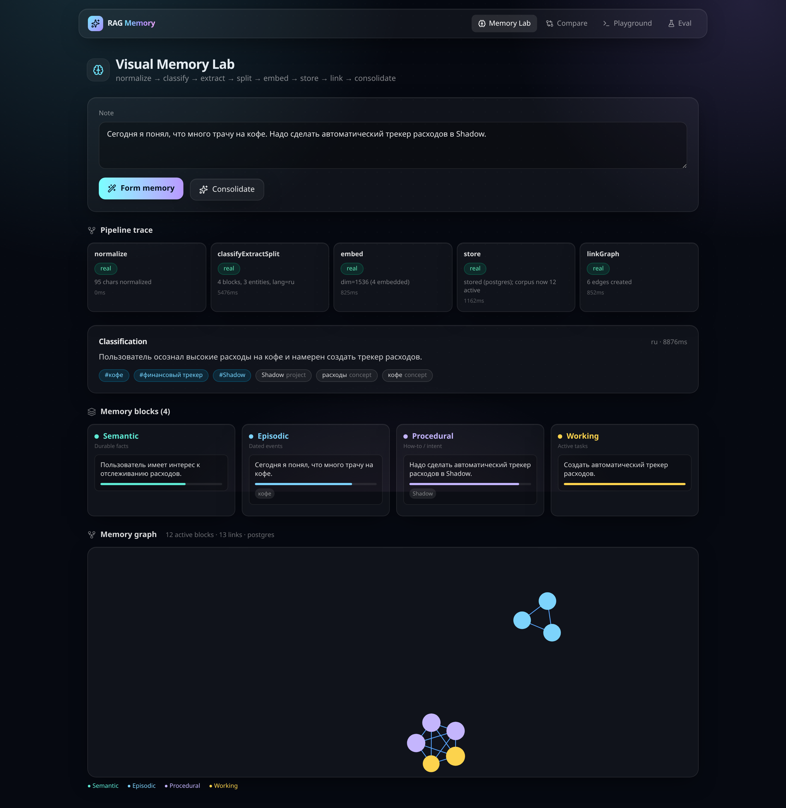
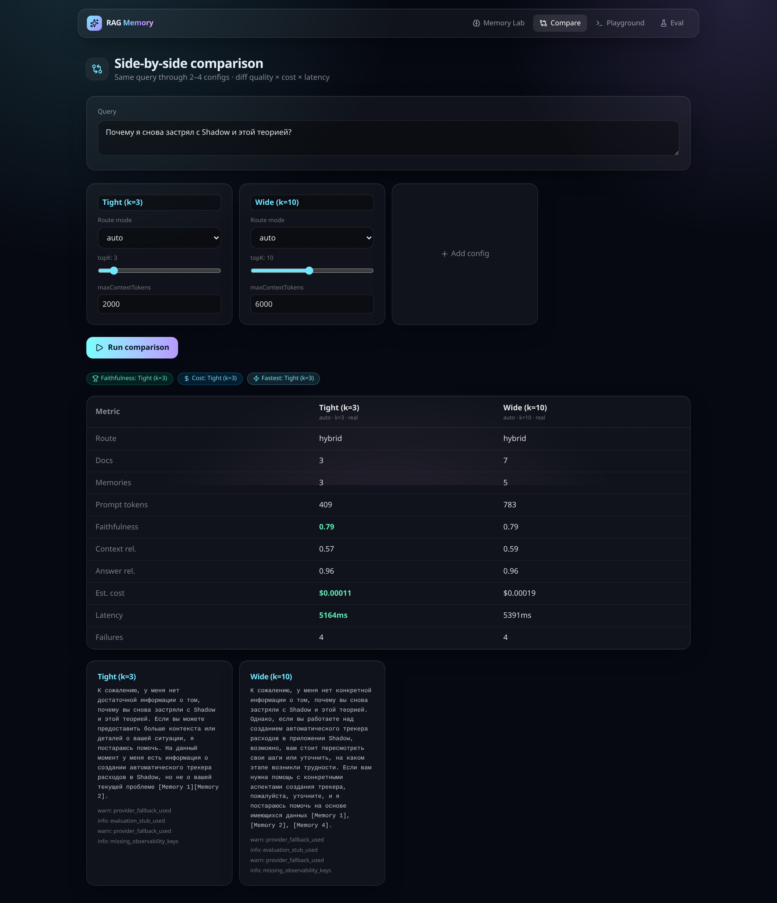
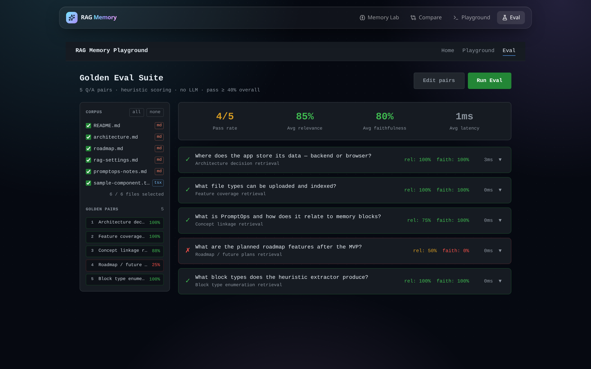
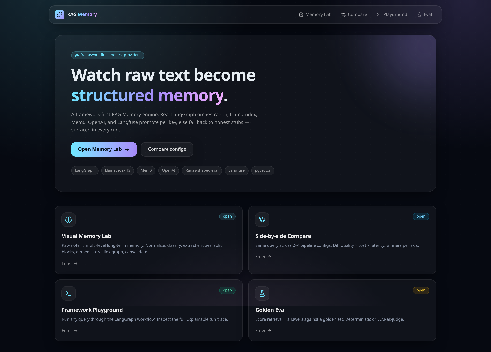
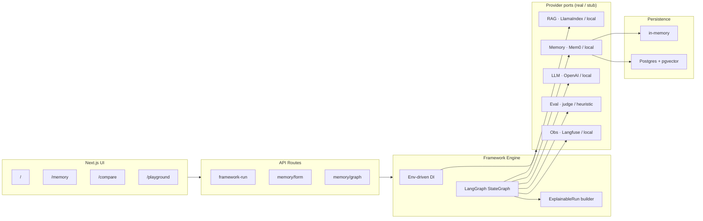

# RAG Memory Playground

**Watch raw text become structured memory — then compare RAG pipelines side by side.**

A framework-first RAG + memory engine. LangGraph orchestration is always real; LlamaIndex.TS retrieval, OpenAI generation, Mem0 memory, and Langfuse observability promote to real providers per API key, otherwise fall back to honest deterministic stubs — and every fallback is surfaced in the response.

🔗 **Live demo:** [rag-playground-tool.vercel.app](https://rag-playground-tool.vercel.app) · **Code:** [github.com/Qalipso/rag-memory-playground](https://github.com/Qalipso/rag-memory-playground)



---

## What it does

Three working surfaces:

- **Visual Memory Lab** (`/memory`) — turn a raw note into multi-level long-term memory: normalize → classify → extract entities → split blocks → embed → store → link graph → consolidate. Full per-stage trace + interactive memory graph.
- **Side-by-side comparison** (`/compare`) — run the same query through 2–4 pipeline configs; diff quality × cost × latency, winners per axis.
- **Golden Eval** (`/eval`) — score retrieval and answers against a versioned ground-truth set.
- **Framework Playground** (`/playground`) — raw `ExplainableRun` JSON for any query, for debugging the graph.

Why it exists: it fills the space between "I have a notebook with LangChain code that works on my laptop" and "we have production RAG and I cannot tell why retrieval quality dropped last Tuesday." It is the experimentation and decision layer that lets a small team make defensible RAG decisions without rebuilding plumbing.

---

## Status

This is a **working prototype**, not a paper spec. Roughly **end of Phase 3** on the roadmap below.

| Capability | Status | Notes |
|---|---|---|
| LangGraph 7-node engine | ✅ Shipped | Orchestration always real |
| LlamaIndex.TS retrieval | ✅ Shipped | Real per key, else lexical stub |
| OpenAI generation | ✅ Shipped | Real per key, else deterministic stub |
| Mem0 cloud memory | ✅ Shipped | Real per key, else in-memory stub |
| Langfuse observability | ✅ Shipped | Real per key, else local stub |
| Memory-formation pipeline (8 stages) | ✅ Shipped | normalize → … → consolidate |
| Visual Memory Lab + graph | ✅ Shipped | `/memory` |
| Side-by-side comparison | ✅ Shipped | `/compare` |
| Postgres + pgvector persistence | ✅ Shipped | env-gated; in-memory default |
| `ExplainableRun` persistence + permalinks | ✅ Shipped | run history |
| LLM-as-judge evaluation | ✅ Shipped | opt-in, OpenAI judge |
| Document upload + sources | ✅ Shipped | `/api/rag-memory/sources/*` |
| Real Ragas metrics | 🟡 Stub | Ragas-shaped heuristics; real Ragas needs a Python sidecar |
| Export-as-code | ⬜ Planned | Phase 3 follow-up |
| Ground-truth authoring UI | ⬜ Planned | Phase 2 design |
| Reranker stage | ⬜ Planned | Phase 3 |
| Auto-search / Pareto front | ⬜ Planned | Phase 4 |
| Failure-mode tagging UI | ⬜ Planned | Phase 5 |
| Production-trace ingestion | ⬜ Planned | Phase 6 |

**Honesty contract:** any provider running in stub or fallback mode is reported in `providerStatus` and added to `failureModes` (severity `info` for evaluation/observability stubs, `warn` for retrieval/memory fallbacks). The tool never pretends a stub is the real thing.

---

## Screenshots

| Side-by-side comparison | Golden Eval |
|---|---|
|  |  |

Home / launcher:



---

## Tech stack

- **Next.js 15** (App Router) UI + API routes
- **LangGraph** (`@langchain/langgraph`) — StateGraph orchestration
- **LlamaIndex.TS** (`llamaindex`) — vector retrieval
- **OpenAI** (`openai`) — generation + LLM-as-judge
- **Mem0** (`mem0ai`) — cloud memory
- **Langfuse** (`langfuse`) — observability traces
- **Postgres + pgvector** (`pg`) — embeddings, memory blocks/edges, runs
- **Zod** validation · **Tailwind** + **framer-motion** UI · **react-force-graph-2d** memory graph

---

## Run locally

Local mode uses deterministic stubs for every provider. No API keys required.

```bash
npm install
npm run dev            # http://localhost:3000 → / lists all surfaces

npx tsx scripts/demo-framework.ts   # LangGraph + local stubs, no keys
npm test                            # all *.test.ts under src/
npm run typecheck
```

The demo prints route decision, provider status, graph steps, retrieved docs/memories, evaluation scores, failure modes, and timing.

### Enable real providers / persistence

Copy `.env.example` → `.env.local`:

```
FRAMEWORK_MODE=real
OPENAI_API_KEY=sk-...        # promotes LlamaIndex retrieval + OpenAI generation + memory extraction
MEM0_API_KEY=...             # promotes memory provider to Mem0 cloud
LANGFUSE_PUBLIC_KEY=...      # promotes observability to Langfuse
LANGFUSE_SECRET_KEY=...
DATABASE_URL=postgres://...  # switches memory store from in-memory to Postgres + pgvector
ALLOW_RUNTIME_CONFIG=1       # local dev only: lets the Settings UI write keys to .env.local
```

Promotion is **per provider** — a missing key leaves that one provider as a stub (surfaced as `provider_fallback_used`); other providers stay real if their keys are present.

Apply the DB schema once: `psql "$DATABASE_URL" -f supabase/migrations/0001_memory.sql` (the store also ensures it idempotently on first use).

### Which parts are real

| Layer | Real provider | Stub fallback |
|-------|---------------|---------------|
| Orchestration | `@langchain/langgraph` StateGraph (always real) | — |
| Retrieval | `llamaindex` VectorStoreIndex | `LocalRagProvider` (lexical) |
| Memory | `mem0ai` cloud | `LocalMemoryProvider` (lexical, in-memory) |
| LLM | `openai` chat completions | `LocalLLMProvider` (deterministic) |
| Observability | `langfuse` traces | `LocalObservabilityProvider` (in-memory) |
| Evaluation | OpenAI LLM-as-judge (opt-in) | Ragas-shaped heuristics |

---

## Core concepts

### ExplainableRun

Every framework run returns one structured object — the same source of truth for the UI and the developer:

```ts
ExplainableRun = {
  runId, input, route,
  providerStatus,        // which providers were real / stub / fallback
  graphSteps,            // which nodes ran, with per-step timing
  retrievedDocuments,
  retrievedMemories,
  finalContext,          // how the final prompt was assembled
  answer,
  evaluations,           // faithfulness / relevance scores + warnings
  trace,
  failureModes,          // named failures, not just numbers
  debug, meta
}
```

Instead of hiding internals behind a chat response, the engine exposes the route taken, which providers were real, which nodes ran, what was retrieved, how the prompt was built, and what failed.

### Honest provider modes

| Mode | Meaning |
|---|---|
| `real` | Real provider initialized and used |
| `stub` | Local deterministic provider used intentionally (no key) |
| `fallback` | Real mode requested, but env/config failed → local provider used |

The app works without secrets, but never pretends a local stub is a production provider.

### RAG + memory routing

The classifier routes the same input through different strategies:

| Mode | Use case |
|---|---|
| `rag` | Use documents / knowledge base |
| `memory` | Use prior user / agent memory |
| `long_context` | Larger direct context when retrieval is not enough |
| `hybrid` | Combine document retrieval + memory retrieval |
| `auto` | Let the classifier choose |

### Memory block levels

The Visual Memory Lab splits a note into typed long-term memory blocks:

| Level | Meaning |
|---|---|
| `working` | immediate current context |
| `episodic` | what happened |
| `semantic` | durable facts / knowledge |
| `procedural` | learned process / how-to |

---

## Tests

- 9 test suites under `src/framework/__tests__/` + `src/__tests__/` (engine, judge, memory formation/retrieval/consolidation, provider status, run store) — run with `npm test`.
- Playwright UI E2E: `e2e/memory.spec.ts` — `npm run test:e2e`.
- CI: `.github/workflows/ci.yml` (install → test → build).

---

## Architecture



The LangGraph state machine runs: `classifyIntent → retrieveDocuments → retrieveMemories → buildContext → generateAnswer → evaluateAnswer → buildExplainableRun`. Each node emits a `GraphStep`, so the response includes a step-by-step execution trace.

More detail: [`architecture.md`](architecture.md) · [`roadmap.md`](roadmap.md) · [`product-brief.md`](product-brief.md) · [`ENGINEERING-NOTES.md`](ENGINEERING-NOTES.md) · [`THEORY.md`](THEORY.md).

### API surface (15 routes)

```
/api/rag-memory/framework-run          run the engine, get an ExplainableRun
/api/rag-memory/compare                run N configs over the same query
/api/rag-memory/memory/form            note → memory blocks + edges
/api/rag-memory/memory/graph           read the memory graph
/api/rag-memory/memory/consolidate     decay / supersede / alias-merge
/api/rag-memory/memories               list formed memories
/api/rag-memory/runs  ·  /runs/[id]    run history + permalinks
/api/rag-memory/sources  ·  /[id]  ·  /upload    corpus management
/api/rag-memory/config  ·  /connect    runtime config + DB connect
/api/embed  ·  /api/faithfulness       embedding + judge helpers
```

---

## Example: run the engine

```bash
curl -X POST http://localhost:3000/api/rag-memory/framework-run \
  -H "Content-Type: application/json" \
  -d '{ "userId": "demo-user", "message": "Why am I stuck on this again?", "mode": "auto" }'
```

Returns an `ExplainableRun`: route decision, `providerStatus`, ordered `graphSteps`, retrieved docs/memories, `finalContext`, `answer`, `evaluations`, `trace`, `failureModes`, and `meta` timing. See `scripts/demo-framework.ts` for a full printed run.

### Failure-mode catalog

| Type | Severity | Trigger |
|------|---------|---------|
| `provider_fallback_used` | warn | Real provider requested but unavailable; using stub |
| `evaluation_stub_used` | info | Evaluator is Ragas-shaped heuristics, not real Ragas |
| `missing_observability_keys` | info | No Langfuse keys; traces are local-only |
| `no_documents_retrieved` | warn | Route requested docs but retrieval returned none |
| `no_memories_retrieved` | warn | Route requested memory but retrieval returned none |
| `low_context_relevance` | warn | Context relevance < 0.3 |
| `low_retrieval_score` | warn | Top retrieval score < 0.3 |
| `empty_context` | critical | Final context contained zero tokens |
| `route_mismatch` | info | Hybrid route picked but evidence missing |
| `framework_error` | critical | LangGraph / LlamaIndex threw |
| `evaluation_failed` | critical | Evaluator threw |

---

## Roadmap

| Phase | Outcome | State |
|-------|---------|-------|
| 0 | Schema, pipeline JSON spec, UI mock | ✅ Done |
| 1 | Single-pipeline runner: build, run, see output + cost | ✅ Done |
| 2 | Side-by-side comparison; ground-truth sets; built-in metrics | ✅ Done |
| 3 | LLM-as-judge; run persistence; trace view; export-as-code | 🟡 Mostly done (export-as-code pending) |
| 4 | Auto-search: hyperparameter sweep + Pareto front | ⬜ Planned |
| 5 | Failure-mode tagging + clustering; real Ragas sidecar | ⬜ Planned |
| 6 | Production-trace ingestion (replay prod queries offline) | ⬜ Planned |

---

## Why I built this

RAG is the most common pattern in production AI apps and the hardest to debug: the config search space is huge, the eval signal is weak, and the cost picture is usually invisible until launch. This project is a working argument that those three problems are a tooling problem — and that the right tool makes comparison, not generation, the first-class surface. The honesty contract (real vs stub, always reported) is the part I am most deliberate about: a demo that hides its stubs is how you "win the demo, lose the launch."

---

## 90-second demo path

1. Open `/memory`, paste a messy note about a project, blocker, or repeated pattern.
2. Run memory formation → inspect extracted entities, typed memory blocks, graph links, consolidation.
3. Open `/compare`, run the same query across multiple configs → compare quality, cost, latency, failure modes.
4. Open `/playground` → inspect the raw `ExplainableRun`; check `providerStatus` to prove which providers are real, stub, or fallback.

---

## Repository structure

```txt
rag-memory-playground/
├── app/                          # Next.js routes + API routes
│   ├── api/rag-memory/           # framework-run, compare, memory, sources, runs
│   ├── memory/                   # Visual Memory Lab
│   ├── compare/                  # side-by-side comparison
│   ├── eval/                     # golden eval suite
│   └── playground/               # raw ExplainableRun debug UI
├── src/framework/                # framework-first engine
│   ├── engine.ts · container.ts · types.ts
│   ├── workflow/                 # LangGraph graph + 7 nodes
│   ├── ports/ · adapters/        # provider interfaces + real/local impls
│   ├── memory/ · knowledge/      # formation, persistence, retrieval
│   └── __tests__/                # contract tests
├── src/core/ · src/mvp/          # legacy Phase 1 simulator
├── supabase/migrations/          # Postgres + pgvector schema
├── e2e/                          # Playwright tests
├── scripts/                      # demos + screenshot capture
└── architecture.md · roadmap.md · product-brief.md · THEORY.md · GUIDE.md
```

---

## What this project demonstrates

Applied AI engineering, specifically: RAG architecture · long-term agent memory · LangGraph orchestration · provider abstraction + dependency injection · real/stub/fallback transparency · explainable run traces · side-by-side pipeline comparison · cost/latency/quality trade-off design · Postgres + pgvector persistence · evaluation-aware product thinking.

## Related docs

| Doc | Purpose |
|---|---|
| [`product-brief.md`](product-brief.md) | Vision, problem, personas, differentiation |
| [`architecture.md`](architecture.md) | System overview and architecture |
| [`roadmap.md`](roadmap.md) | Build phases and shipped status |
| [`acceptance-criteria.md`](acceptance-criteria.md) | Gherkin-style acceptance tests |
| [`GUIDE.md`](GUIDE.md) | Builder-friendly RAG memory guide |
| [`THEORY.md`](THEORY.md) | Research-backed RAG + memory theory |

---

Built by **Eduard Shatalov** as part of an AI product engineering portfolio. MIT licensed.
