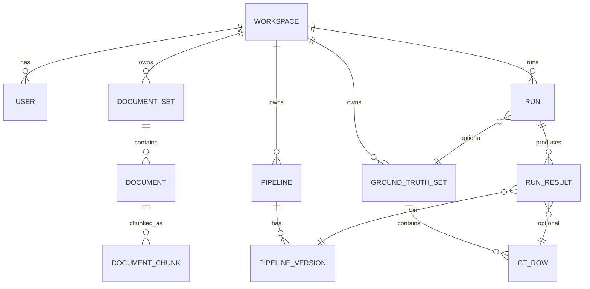

# Data Model

## Cache keys

| Cache | Key | Reused when |
|-------|-----|------------|
| Chunks | (document_id, chunker_hash) | Same doc + same chunker config |
| Embeddings | (chunk_id, embedder_hash) | Same chunk + same embedder |
| Retrieval | NOT cached | Cheap to recompute; depends on query |
| Generator output | NOT cached | Deliberately re-run for non-determinism |

## Notes

- `PIPELINE_VERSION.config_json` is hashed; identical content collapses to one row
- `RUN_RESULT.metrics` is JSONB; built-in metrics are top-level keys, custom scorers append
- `GT_ROW.source_doc_ids` is an array for cases where the ideal answer spans multiple documents
- Workspace isolation enforced at the orchestrator middleware
