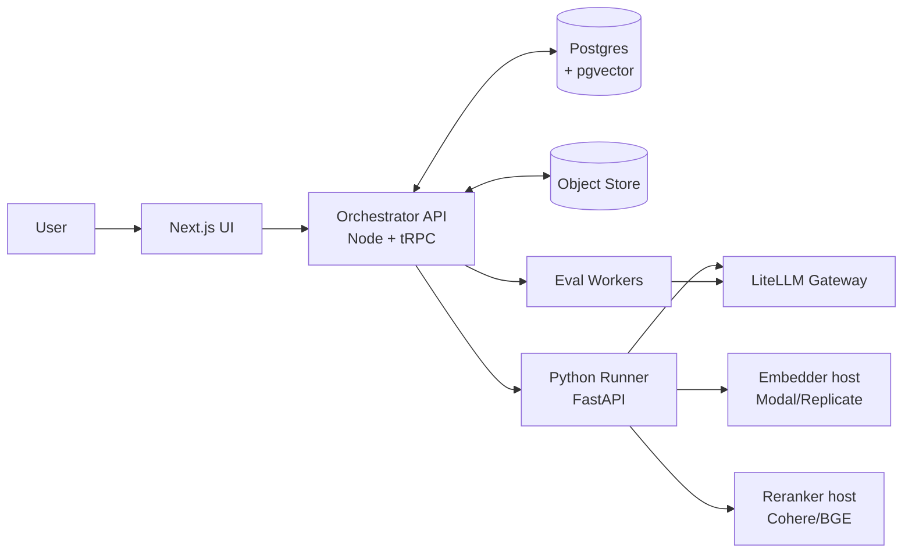
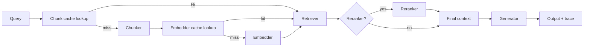

# System Diagram



## Sequence: Side-by-side run

```mermaid
sequenceDiagram
    autonumber
    participant U as User
    participant UI
    participant API as Orchestrator
    participant R as Python Runner
    participant DB as Postgres
    participant E as Eval Workers

    U->>UI: select 3 pipelines + GT set "support-qa v1.1"
    UI->>API: POST /runs (pipeline_ids, gt_set_id)
    API->>DB: create Run + 3×25 pending RunResults
    par for each pipeline
      API->>R: execute pipeline on all 25 queries
      R->>DB: persist retrieved chunks, context, output, cost, latency
    end
    API->>E: enqueue eval jobs (faithfulness, recall, judge)
    E->>DB: persist metric scores
    API-->>UI: stream progress; render comparison view
```

## Pipeline execution detail


